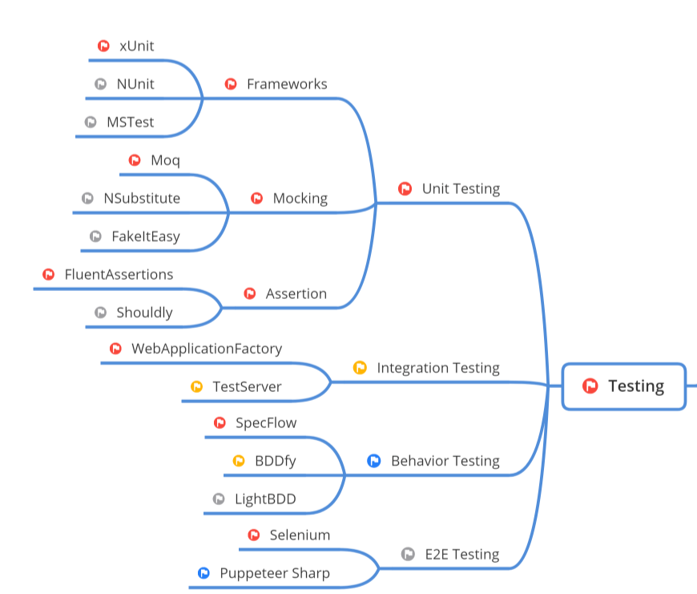

#Dominando os Testes de Software

##Por que testar?

- Processo de executar programa para encontrar defeitos    
- Avaliação na qual permite determinar resultados desejados

[Origem da imagem](https://github.com/MoienTajik/AspNetCore-Developer-Roadmap)

A Certificação por terceiros envolve três fatores principais:
- Normas
    - ISO
- Orgãos
    - Inmetro
- Organismos
    - Sistemas de Gestão de Tecnologia da Informação
    - Sistemas de Gestão Ambiental - OCA

Geralmente as empresas não pedem uma certificação de testes como as outras indústrias

##Como testar?

###Testes de Caixa-Preta e Caixa-Braca

 - Caixa-Preta
    - Testes Funcionais
    - Testes de Regressão
    - Testes na interfaces de usuários
 - Caixa-Branca
    - Buscar erros
    - Debug
    - Testes de unidade
    - Testes de Integração

Existe vários tipos de testes para garantir, porém não existe nenhum orgão que define quais usar.

###Testes de baixo nível
- Análise de código
- Programação em par
- Testes de unidade
- Testede integração entre componentes

###Testes de alto nível
- Testes exploratórios
- Testes não funcionais
    - Funcionalidade
    - Confiabilidade
    - Usabilidade
    - Eficiência
    - Manuntenibilidade
    - Portabilidade
- Teste de integração de sistema
- Teste de aceitação(Story Tests)

##"Quadrante Mágico" do teste ágil

- Q1
    - Unit Tests
    - Component test
- Q2
    - Functional Tests
    - Story Tests
    - Prototypes
    - Simulations
- Q3
    - Exploratory Testing
    - Scenarios
    - Usability Testing
    - UAT (User Acceptance Testing)
- Q4
    - Performance & Load Testing
    - Security Testing
    - "illity" Testing

##Consequências de não testar
- Muitos bugs e problemas de qualidade
- Falhas de codificação
- Possíveis atrasos na entrega
- Perda de confiança do cliente
- Desmotivação do time
- Possíveis implicações legais

##Regra 10 de Myers

Corrigir um bug em produção custa muito mais caro do que fosse encontrado na fase de análise ou desenvolvimento.

##Tipos de testes mais comuns
- Testes de Unidade
    - Um teste de unidade é aquela que testa uma única unidade do sistema.
    - SRP => Single Principle Responsability
- Testes de Integração
    - O Teste de integração é aquele que testa a integração entre duas ou mais partes da sua aplicação
- Testes Automatizados
    - O teste automatizado é um teste de sistema, podemos considerar como um teste de aceitação, funciona como um teste de caixa preta, já que o sistema é testado de ponta a ponta através das operações executadas no sistemas.
- Teste de carga
    O teste de carga(load teste) consiste em testar as  capacidades da aplicação não consiga mais responder. Pode ser também considerado como um teste de stress.